# Compiler

A small compiler and bytecode interpreter written in Swift. It includes an
end-to-end source pipeline, semantic analysis, a backend-neutral intermediate
representation, stack and register bytecode targets, validation, and virtual
machines for both targets.

The project is intentionally compact and suitable for experimenting with
language implementation techniques. Its `comp` executable is also an
integration harness for the companion Grammar, Lexer, Parser, Earley, CYK, and
RNGLR packages.

[](https://swift.org)  
[](https://developer.apple.com/swift/)  
[](LICENSE)  

---

## Features

- source lexer and recursive-descent/precedence parser;
- concrete adapter for the shared generalized-parser `ParseTree`;
- selectable Earley, CYK, and RNGLR parsing from the command line;
- selectable hand-written tokenizer or DFA Lexer frontend;
- versioned JSON syntax-tree-to-AST actions covering the complete language AST;
- separate source and resolved typed ASTs;
- source-located lexer, parser, semantic, lowering, validation, and runtime
  diagnostics;
- static primitive, array, and named record types;
- declarations, initialization, assignment, blocks, `if`/`else`, `while`,
  functions, recursive calls, arrays, records, returns, `print`, and integer `read`;
- stable symbol identities and distinct local storage slots;
- shared, backend-neutral IR with symbolic labels and basic-block CFGs;
- stack and 32-register bytecode targets;
- control-flow and type-state bytecode verification before execution;
- register spilling for expressions exceeding the 32-register file;
- versioned, big-endian binary bytecode serialization;
- injectable input, output, and trace handlers;
- public compilation artifacts for inspecting the typed AST, symbols, and IR;
- unit, integration, negative, and cross-backend equivalence tests.

## Architecture

```mermaid
flowchart LR
    Source["Source text"] --> External["Grammar + Lexer/Tokenizer + Earley/CYK/RNGLR"]
    External --> Adapter["GeneralizedParseTreeAdapter"]
    Adapter --> Syntax["SyntaxNode"]
    Syntax --> Builder["ASTBuilder + ASTMapping"]
    Parser --> AST["ASTNode"]
    Builder --> AST
    AST --> Semantic["SemanticAnalyzer"]
    Semantic --> Typed["Typed AST + Symbols"]
    Typed --> IR["IRLowerer"]
    IR --> StackGen["StackCodeGenerator"]
    IR --> RegisterGen["RegisterCodeGenerator"]
    StackGen --> StackCheck["BytecodeValidator"]
    RegisterGen --> RegisterCheck["BytecodeValidator"]
    StackCheck --> StackVM["StackMachine"]
    RegisterCheck --> RegisterVM["RegisterMachine"]
```



Without `--actions`, the external parser validates the source and the compact
compiler-owned parser builds the language AST. With `--actions`, `ASTBuilder`
constructs that AST directly from the selected external parse tree. Semantic
analysis then produces a distinct `ResolvedASTNode` tree in which every
variable occurrence contains its `SymbolID` and storage slot.

## Language

### Types and values

| Source type | Compile-time type  | Runtime value          |
| ----------- | ------------------ | ---------------------- |
| `int`       | `TypeInfo.int`     | `Value.int(Int64)`     |
| `float`     | `TypeInfo.float`   | `Value.float(Double)`  |
| `string`    | `TypeInfo.string`  | `Value.string(String)` |
| `boolean`   | `TypeInfo.boolean` | `Value.boolean(Bool)`  |
| `null`      | `TypeInfo.null`    | `Value.null`           |
| `T[]`       | `TypeInfo.array`   | `Value.array`          |
| named type  | `TypeInfo.record`  | `Value.record`         |

`TypeInfo.any` is an unresolved AST annotation used before semantic analysis.
It is not a runtime type.

Integer values may be assigned to floating-point variables. Other assignments
must have matching types. Conditions for `if` and `while` must be Boolean.

### Expressions

The parser implements conventional precedence:

1. grouping and literals;
2. unary `-`;
3. `*`, `/`, `%`;
4. `+`, `-`;
5. `<`, `<=`, `>`, `>=`;
6. `==`, `!=`.

Arithmetic supports mixed integer/floating-point operands. `+` also
concatenates two strings. Ordered string comparisons are supported.

### Statements

```text
var count: int = 1;
var inferred = 10;
count = count + inferred;

if (count > 5) {
    print "large";
} else {
    print "small";
}

while (count < 20) {
    count = count + 1;
}

read count;
print count;

func factorial(n: int): int {
    if (n <= 1) {
        return 1;
    } else {
        return n * factorial(n - 1);
    }
}

print factorial(5);

type Point {
    x: int;
    y: int;
}
var points: Point[] = [
    Point { x: 1, y: 2 },
    Point { x: 3, y: 4 }
];
points[0].x; // nested reads are supported
```

Semicolons terminate declarations, assignments, I/O statements, and expression
statements. Blocks use braces. Line comments begin with `//`.

## Quick start

Requirements:

- Swift tools 5.9 or newer;
- macOS 13+ or iOS 14+ for the package (RNGLR currently requires macOS 13);
- network access when dependencies are first resolved.

Build and test:

```sh
swift build
swift test
```

Run the included end-to-end example:

```sh
swift run comp Examples/arithmetic.bnf Examples/arithmetic.comp \
  --start program --parser earley --lexer tokenizer \
  --target stack --emit trees bytecode result
```

## Command-line integration

Synopsis:

```text
comp <grammar-file> <source-file>
  --start <rule>
  [--notation bnf|ebnf|wsn|gen]
  [--parser earley|cyk|rnglr]
  [--lexer tokenizer|dfa]
  [--ambiguity reject|first|all]
  [--target stack|register]
  [--actions <mapping.json>]
  [--emit grammar tokens trees ast typed-ast ir bytecode result ...]
  [--parse-only]
  [--trace]
  [--output <bytecode-file>]
```

The grammar notation defaults to the grammar file extension. `--start` is
required for BNF, EBNF, and WSN; `.gen` grammars carry their own start
declaration.

`--actions` changes the integration from “validate externally, parse with the
built-in parser” to “compile the external parse tree directly.” The mapping is
a Codable JSON document with `version: 1` and an `actions` dictionary keyed by
grammar rule. `ASTAction` includes actions for every compiler AST construct:
programs, blocks, literals, operators, declarations, control flow, functions,
calls, returns, arrays, indexing, named types, records, and member access.
Child numbers refer to the adapted `SyntaxNode.children` array. The Codable
representation can be generated reliably in Swift:

```swift
let mapping = ASTMapping(actions: [
    "integer": .integer,
    "sum": .binary(leftChild: 0, operatorChild: 1, rightChild: 2),
    "statement": .print(valueChild: 1),
    "program": .block(children: [0]),
])
let data = try JSONEncoder().encode(mapping)
```

Pass the resulting file with `--actions mapping.json`. Keeping the mapping
outside the grammar makes grammar experimentation possible without coupling
the compiler core to any particular production names.

The default `--lexer tokenizer` path exercises GrammarTokenizer through each
parser's standard interface. `--lexer dfa` constructs a DFA lexer from the
grammar's terminals, feeds a `LexerTokenStream` to Earley, and is currently
restricted to `--parser earley` because only that parser exposes both generic
token-stream parsing and natural-grammar tree reconstruction publicly.

Examples:

```sh
# Earley + GrammarTokenizer
swift run comp Examples/arithmetic.bnf Examples/arithmetic.comp \
  --start program --parser earley --emit trees result

# DFA Lexer + Earley + SPPF extraction
swift run comp Examples/arithmetic.bnf Examples/arithmetic.comp \
  --start program --parser earley --lexer dfa --emit tokens trees result

# Exercise the alternative generalized parsers
swift run comp Examples/arithmetic.bnf Examples/arithmetic.comp \
  --start program --parser cyk
swift run comp Examples/arithmetic.bnf Examples/arithmetic.comp \
  --start program --parser rnglr

# Inspect only parsing and every derivation
swift run comp grammar.bnf source.comp --start program \
  --ambiguity all --emit grammar trees --parse-only

# Compile, trace, and save a versioned bytecode image
swift run comp grammar.bnf source.comp --start program \
  --target stack --trace --output program.cmpb
```

By default ambiguous input is rejected. `first` selects the first deduplicated
derivation, while `all` adapts and prints every derivation. Without
`--actions`, compilation uses the built-in language parser and the supplied
grammar should recognize the same language. With `--actions`, the first
selected external derivation is the source of the compiler AST.

## Library usage

### Compile and execute source

```swift
import Compiler

let source = """
var x: int = 1;
var total: int = 0;

while (x <= 5) {
    total = total + x;
    x = x + 1;
}

print total;
"""

let compiler = Compiler()
let result = try compiler.execute(
    source,
    output: { print("program:", $0) }
)
```

### Inspect compilation artifacts

```swift
let ast = try compiler.parse(source, file: "example.comp")
let artifacts = try compiler.analyze(ast)

print(artifacts.typedAST)
print(artifacts.symbols)
print(artifacts.ir.operations)

let stack = try StackCodeGenerator.generate(artifacts.ir)
let registers = try RegisterCodeGenerator.generate(artifacts.ir)
```

### Select a backend

```swift
let artifacts = try compiler.analyze(ast)
let stackCode = try StackCodeGenerator.generate(artifacts.ir)
let registerCode = try RegisterCodeGenerator.generate(artifacts.ir)

let stackResult = try StackMachine(
    bytecode: stackCode.instructions,
    localCount: stackCode.localCount
).execute()
let registerResult = try RegisterMachine(
    bytecode: registerCode.instructions,
    localCount: registerCode.localCount
).execute()
```

### Inject input, output, and tracing

```swift
let compilation = try compiler.compile("var x: int; read x; print x + 1;")

let machine = StackMachine(
    bytecode: compilation.instructions,
    localCount: compilation.localCount,
    input: { "41" },
    output: { value in print("output:", value) }
)

_ = try machine.executeWithTrace { event in
    print("trace:", event)
}
```

Machine state is local to each `execute` call, so an instance can be executed
again as a fresh run.

## External parser integration

`GeneralizedParseTreeAdapter` directly adapts the shared Parser package tree:

```swift
let trees = try EarleyParser(grammar: grammar).allSyntaxTrees(for: source)
let forest = try GeneralizedParseTreeAdapter(source: source)
    .adapt(trees, ambiguity: .reject)
print(forest.trees[0].formattedTree())
```

`ASTBuilder` interprets the resulting tree using an `ASTMapping`. The built-in
mapping supports expression nodes named `integer`, `float`, `string`,
`boolean`, `null`, `identifier`, `unary`, `binary`, `group`, and `expression`.
Projects can provide a mapping matching their grammar rule names:

```swift
let mapping = ASTMapping(actions: [
    "sum": .binary(leftChild: 0, operatorChild: 1, rightChild: 2),
    "wholeNumber": .integer,
])

let ast = try ASTBuilder(mapping: mapping).build(from: syntaxTree)
```

Malformed child shapes and unmapped productions produce parsing diagnostics
instead of unchecked child indexing.

## Intermediate representation

`IRProgram` contains typed, backend-neutral stack operations:

- constants and local loads/stores;
- unary and binary operations;
- symbolic labels and conditional/unconditional jumps;
- print, read, discard, and halt.
- function calls and returns.
- array construction/indexing and named-record construction/field access.

Both code generators consume this IR. Control-flow lowering therefore has one
implementation, and label resolution happens independently for each concrete
instruction layout. `IRProgram.controlFlowGraph()` partitions operations into
`IRBasicBlock` values and records successor edges for analysis.

## Bytecode

### Stack target

Stack instructions use implicit operands:

```text
push 2
push 3
add
push 4
mul
halt
```

`StackCompilation` includes the instruction array and required local count.

### Register target

Register instructions expose data flow:

```text
move R0 #2
move R1 #3
add R2 R0 R1
```

The generator uses 32 physical registers and reuses temporaries. When pressure
exceeds the register file, additional values are assigned explicit spill slots
(`S0`, `S1`, …), which the register VM stores separately.

The register calling convention supports up to eight arguments. Arguments are
placed in `R0` through `R7`, the return value is placed in `R0`, and `call`
preserves the caller's registers, spill locations, and locals. Consequently,
direct calls, nested calls, and recursion behave identically on both targets.

### Validation

`BytecodeValidator` checks:

- stack instruction operand counts;
- stack underflow across control-flow edges;
- equal stack heights at CFG merge points;
- abstract stack type compatibility for arithmetic, comparisons, negation, and
  Boolean branches;
- operand kinds;
- jump bounds;
- local-slot bounds;
- register bounds;
- register instruction shapes.

Both machines validate bytecode before executing it. Malformed instructions
produce validation diagnostics rather than force-unwrap traps.

### Serialization

`BytecodeSerializer` encodes either target as a `.cmpb` image with:

- magic bytes `CMPB`;
- format version `2`;
- target and local-count metadata;
- big-endian integer encoding;
- UTF-8 length-prefixed strings;
- target-specific instructions and operands.

Decoding rejects unknown versions, malformed tags, invalid UTF-8, trailing
data, and bytecode that fails verification:

```swift
let data = try BytecodeSerializer.encode(.stack(compilation))
let image = try BytecodeSerializer.decode(data)
try BytecodeSerializer.write(image, to: outputURL)
```

## Diagnostics

All stages use `Diagnostic`:

```swift
public struct Diagnostic: Error {
    public let stage: Stage
    public let message: String
    public let range: SourceRange?
}
```

Stages are `lexing`, `parsing`, `semantic`, `lowering`, `validation`, and
`runtime`. Source parsing preserves file, line, column, and offset information.

## Package layout

```text
Sources/
├── Compiler/
│   ├── Model.swift
│   ├── Frontend.swift
│   ├── ExternalParserAdapter.swift
│   ├── SemanticAnalyzer.swift
│   ├── IR.swift
│   ├── IRControlFlow.swift
│   ├── Bytecode.swift
│   ├── BytecodeSerialization.swift
│   ├── CodeGenerator.swift
│   ├── Runtime.swift
│   └── Compiler.swift
└── comp/
    ├── CompilerTool.swift
    ├── Comp.swift
    └── Definitions.swift

Tests/
└── CompilerTests/
    └── CompilerTests.swift
```

The module name and library product are both `Compiler`.

## Tests

The Swift Testing suite covers:

- precedence parsing and source-located lexer errors;
- declarative AST mapping and malformed rules;
- real Earley parse-tree adaptation and ambiguity handling;
- type inference, undefined symbols, assignments, and Boolean conditions;
- distinct declaration slots and initializers;
- IR lowering and both code generators;
- malformed stack/register bytecode;
- control flow, input, output, and runtime failures;
- repeatable machine execution;
- stack/register behavioral equivalence;
- recursive function call frames;
- recursive register calls and calling-convention preservation;
- resolved symbol identity and lexical shadowing;
- arrays, indexing, records, and field mutation on both targets;
- JSON AST-action encoding;
- CFG formation and type-state rejection;
- register spilling;
- stack/register serialization round trips.

Run it with:

```sh
swift test
```

## Dependencies

Direct dependencies are:

- [Grammar](https://github.com/hakkabon/Grammar)
- [Lexer](https://github.com/hakkabon/Lexer) and
  [Lexer-FSA](https://github.com/hakkabon/Lexer-FSA)
- [Parser](https://github.com/hakkabon/Parser)
- [Earley-Parser](https://github.com/hakkabon/Earley-Parser)
- [CYK-Parser](https://github.com/hakkabon/CYK-Parser)
- [RNGLR-Parser](https://github.com/hakkabon/RNGLR-Parser)
- [swift-argument-parser](https://github.com/apple/swift-argument-parser)

The hakkabon packages currently track their `main` branches so this repository
can exercise their latest implementations together. `Package.resolved` records
the exact tested revisions.

## Current limitations and roadmap

- The built-in source parser intentionally implements a small language.
- External parse trees require a grammar-specific `ASTMapping`; the compiler
  cannot infer the intended semantics of arbitrary production names.
- The DFA grammar-to-lexer bridge supports literal, list, range, and regular
  expression terminals. A literal double quote cannot currently be represented
  by the Lexer-FSA escape syntax used by the bridge.
- DFA mode currently pairs with Earley; CYK's natural-tree transformer and
  RNGLR's token-stream entry point are not public in forms that can be composed
  this way.
- Register calls are intentionally limited to eight arguments.
- Aggregate mutation currently targets a named variable (`a[i] = value` and
  `record.field = value`); mutation through an arbitrarily nested l-value is
  not implemented.
- Empty array literals have element type `any` until assigned to a declared
  array type.
- Modules, closures, captured variables, methods, and recursive structural
  type definitions are not implemented.
- Register spills are explicit VM locations rather than loads/stores inserted
  by a liveness-based allocator.
- The bytecode format is versioned but not promised ABI-stable across a future
  major format version.

Potential extensions are nested l-values, methods, modules, closures, and a
liveness-based allocator. These are deliberately outside the compact core.

---

## License

MIT License — see [LICENSE](LICENSE) for details.  
